# frida-notes
断断续续学了点，汇总下

[TOC]

目录：

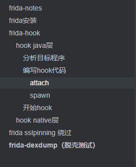

# frida安装

```
电脑：
python -m pip install frida
如果出现ERROR: Failed building wheel for frida 就去下面的链接下载一个对应的egg文件到当前用户目录 比如c:\users\administrator\，然后再执行上面的命令
https://pypi.org/project/frida/#files

坑点：要对应python版本 不然会报dll找不到 目前最高3.8（2021.12）

然后
python -m pip install frida-tools
```


```
手机或者模拟器：
先看手机架构
adb shell getprop ro.product.cpu.abi或者devcheck
```

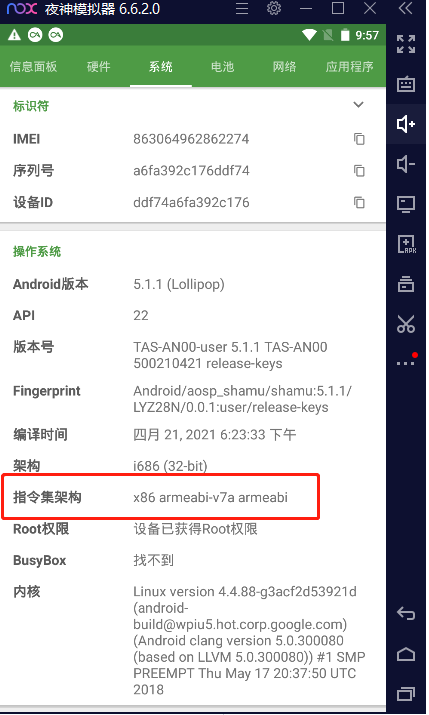

https://github.com/frida

下载对应版本 对应架构的frida-server：

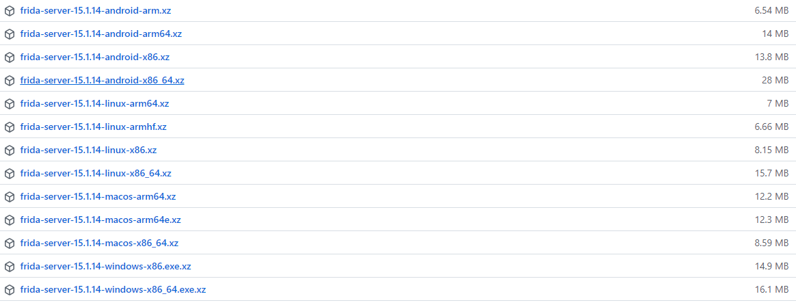

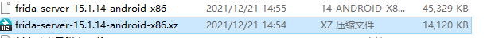

```
解压，重命名为frida-server 用adb复制到手机中 并且执行。
夜神自带的adb在\Nox\bin目录下 加个系统变量就ok
adb push frida-server /data/local/tmp
adb shell "chmod 755 /data/local/tmp/frida-server"
adb shell "/data/local/tmp/frida-server &"

然而夜神模拟器这个安卓5.1版本的会报错，改成7.1版本的了
```

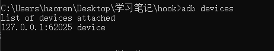

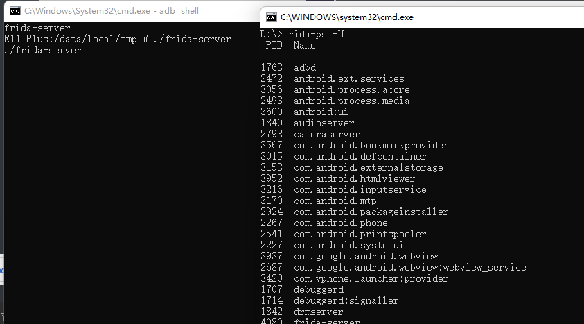

可以看到frida-server进程已经起来了，到此环境配置完成

# frida-hook

## hook java层

参考：https://bbs.pediy.com/thread-227232.htm

跟着大佬学习的笔记 作者不知道是不是不小心，留了一些坑，填坑花了比较多的时间

 

```
1.分析目标app程序 找到hook的具体类以及方法名，参数等这些基本信息
2.编写hook代码
3.运行命令开始hook
```

这里以一个ctf题目的apk（rps.apk）作为例子

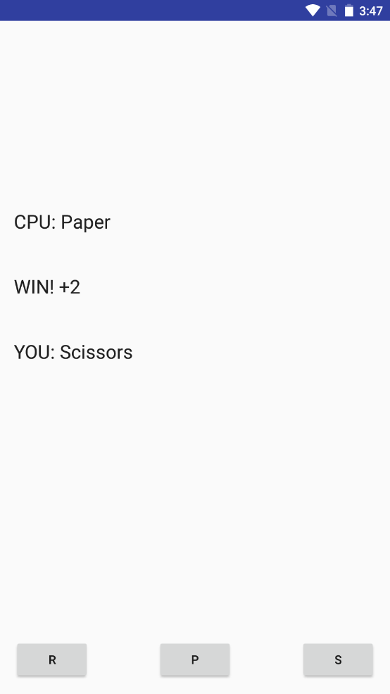

### 分析目标程序

分析肯定得逆向，要逆一般得查查壳，这里例子没壳

然后我们用一些逆向工具（androidkiller jeb jadx等等）打开


首先看到这个run方法，类似于一个猜拳游戏 每次赢了cnt加1，输了cnt重置为0，cnt的值为1000才能爆出flag

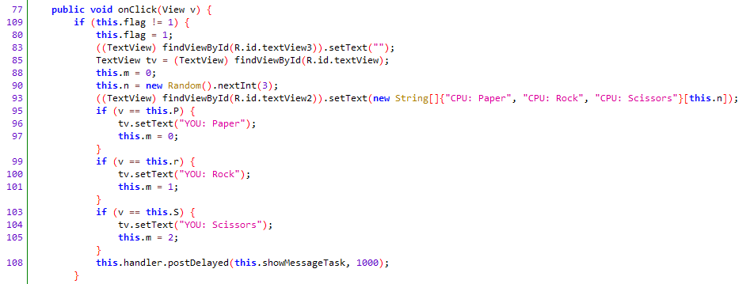

在onclick方法中

this.n = new Random().nextInt(3);

这里n是电脑出的，是随机的。

我们回顾下flag输出的地方：

```java
if (1000 == MainActivity.this.cnt) {
                tv3.setText("SECCON{" + String.valueOf((MainActivity.this.cnt + MainActivity.this.calc()) * 107) + "}");
            }

```

整个flag的表示式就MainActivity.this.calc()不清楚

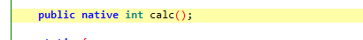

这个calc方法在native层，应该在某个so文件里面，因此这里有个思路就是直接ida打开so文件，找对应calc方法，但是如果方法内容比较复杂，f5之后大概率看不懂。。。

最好的还是直接执行calc方法获取返回值或者将cnt的值置为1000

目的有了 进行下一步

### 编写hook代码

#### attach

先看看hook代码的模板：

```python
#python作为载体，javascript作为在android中真正执行代码
import frida, sys
 
#hook代码，采用javascript编写
jscode = """
//javascript代码，重点
"""
 
#自定义回调函数
def on_message(message, data):
    if message['type'] == 'send':
        print("[*] {0}".format(message['payload']))
    else:
        print(message)
 
#重点的4行代码 别用get_usb_device方法了 改用get_remote_device
process = frida.get_remote_device().attach('应用完整包名')
script = process.create_script(jscode)
script.on('message', on_message)
script.load()
sys.stdin.read()
```

js代码：

```javascript
//Java.Perform 开始执行JavaScript脚本。
Java.perform(function () {
//定义变量MainActivity，Java.use指定要使用的类
    var MainActivity = Java.use('com.example.seccon2015.rock_paper_scissors.MainActivity');
    //hook该类下的onCreate方法，重新实现它
    MainActivity.onCreate.implementation = function () {
        send("Hook Start...");
        //调用calc()方法，获取返回值
        var returnValue = this.calc();
        send("Return:"+returnValue);
        var result = (1000+returnValue)*107;
        //解出答案
        send("Flag:"+"SECCON{"+result.toString()+"}");
    }
});
```


#### spawn

值得注意的是，这里要hook oncreate，启动的时候oncreate已经执行过了，在attach就不会运行oncreate的代码了，这里看雪的老哥居然成了，我也不知道他咋成的。安卓activity生命周期：

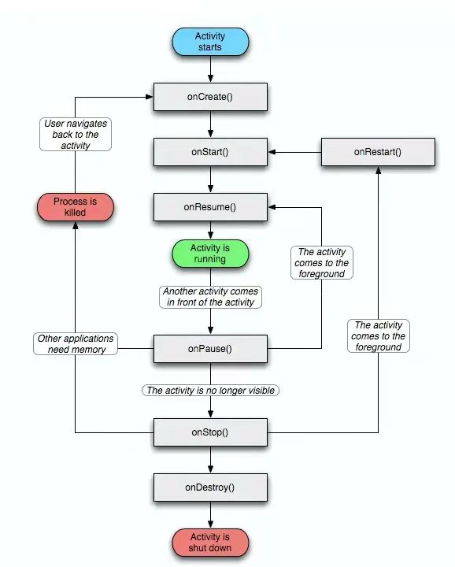

这里要hook 得用spawn，在启动onCreate方法前完成脚本的启动，这时候就能hook住onCreate中执行的一些方法

然后再this.onCreate(bundle)启动应用 保证onCreate执行

完整脚本：

```python
#python作为载体，javascript作为在android中真正执行代码
import frida, sys
 
#hook代码，采用javascript编写
jscode = """
//Java.Perform 开始执行JavaScript脚本。
Java.perform(function () {
    console.log("ttttt")
//定义变量MainActivity，Java.use指定要使用的类
    var MainActivity = Java.use('com.example.seccon2015.rock_paper_scissors.MainActivity');
    //hook该类下的onCreate方法，重新实现它
    MainActivity.onCreate.implementation = function (bundle) {
        console.log("hooking ----")
        send("Hook Start...");
        //调用calc()方法，获取返回值
        var returnValue = this.calc();
        send("Return:"+returnValue);
        var result = (1000+returnValue)*107;
        //解出答案
        send("Flag:"+"SECCON{"+result.toString()+"}");
        //启动应用 保证onCreate执行
        this.onCreate(bundle)
    }
});
"""
 
#自定义回调函数
def on_message(message, data):
    if message['type'] == 'send':
        print("[*] {0}".format(message['payload']))
    else:
        print(message)
 
#重点的代码
device = frida.get_remote_device()
pid = device.spawn("com.example.seccon2015.rock_paper_scissors")

session = device.attach(pid)

script = session.create_script(jscode)

device.resume(pid)

script.on('message', on_message)
script.load()
sys.stdin.read()
```

### 开始hook

启动frida-server

```
如果出现frida.ServerNotRunningError: unable to connect to remote frida-server的错误，试试端口转发：
adb forward tcp:27042 tcp:27042
adb forward tcp:27043 tcp:27043
```

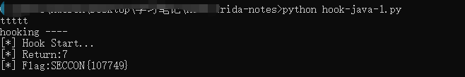

值得注意的是 按理说应该执行脚本就有结果了，但是我用模拟器每次得回到桌面再打开才有结果

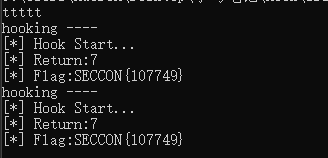

后来几经测试，发现是js代码还没执行（load()），就resume启动程序加载了oncreate方法，经过修改把resume，放到script.load下面，就ok了

原来有问题的代码：

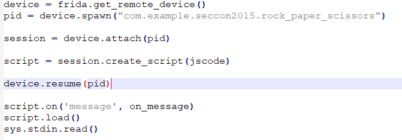

修改之后

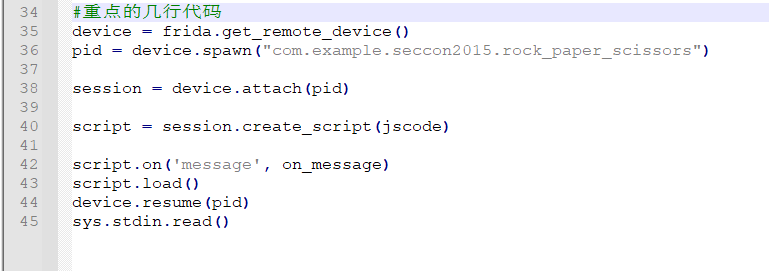

直接执行脚本就ok了

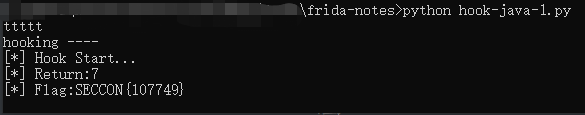

## hook native层


# frida sslpinning 绕过

sslpinning: app采用pinning验证证书或公钥

比如，开代理就gg，导入证书也没用


```
先把burp证书复制进去
adb push PortSwiggerCA.crt /data/local/tmp/cert-der.crt
```

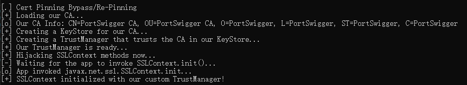

脚本地址：

https://codeshare.frida.re/browse


# frida-dexdump（脱壳测试）

```
python -m pip install frida-dexdump
frida-dexdump -h
```

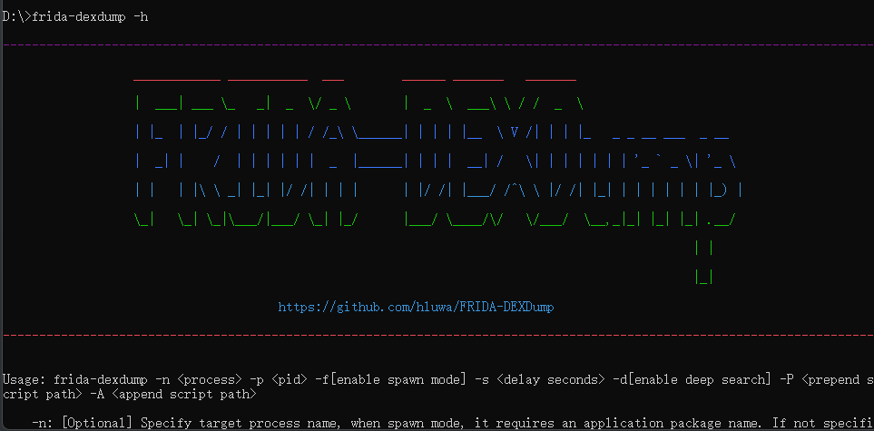

```
先用frida-ps -U找到要导出的进程
frida 14统一用的包名，15开始有部分就是中文了 用中文那个
4126  酷安
```

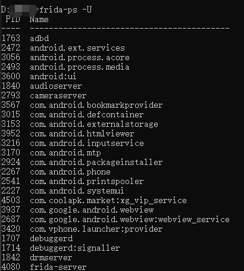

```
frida-dexdump -p 4126
导出一堆dex 
```


```
dex2jar转换成jar包，然后就能看到java代码了
目标是 X-App-Token 的编码过程

可疑dex：
0x94a87000.dex
0x9606f000.dex
```

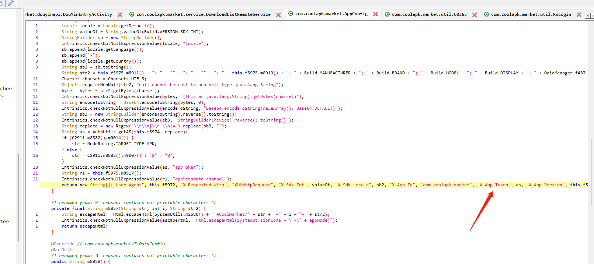

```

String replace = new Regex("\\r\\n|\\r|\\n|=").replace(sb3, "");
String as = AuthUtils.getAS(this.f5974, replace);

```

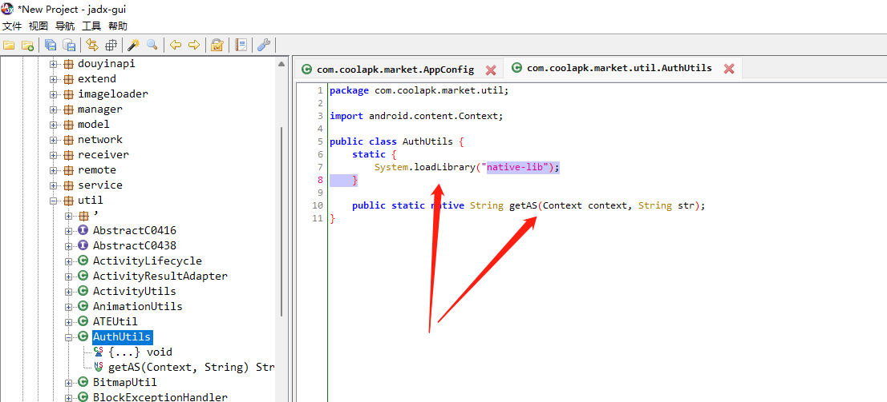

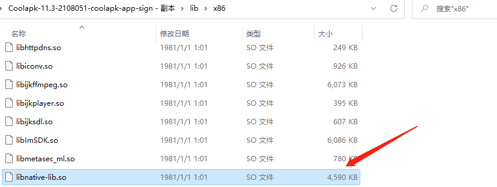

疑似在这里

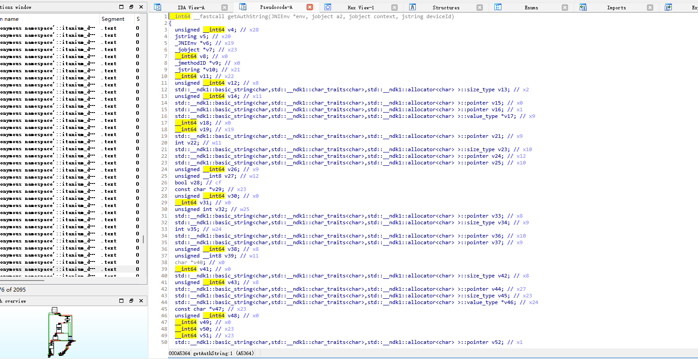

这就头大了

